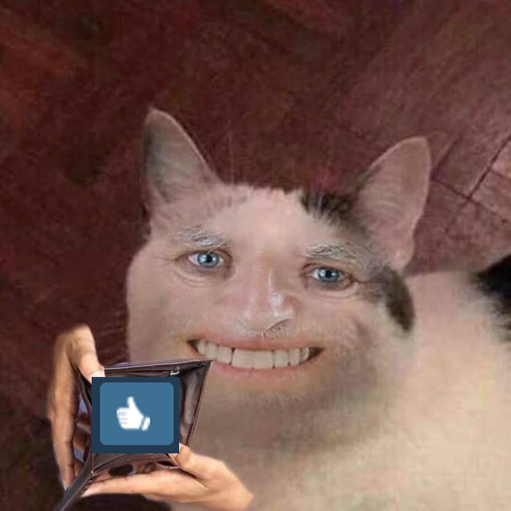

# Custom Shape Audio Visualization Documentation

> [!TIP]
> **Status:** Completed.

## Table of Contents

### 1. Getting Started
- [1.1 - Add and run](docs/1.%20Getting%20Started/1.1%20-%20Add%20and%20run.md)
- [1.2 - Some basics](docs/1.%20Getting%20Started/1.2%20-%20Some%20basics.md)
- [1.3 - Create a shape (MUST READ)](docs/1.%20Getting%20Started/1.3%20-%20Create%20a%20shape%20(MUST%20READ).md)

### 2. Full Settings Guide
- [2.1 - Shape Config](docs/2.%20Full%20Settings%20Guide/2.1%20-%20Shape%20Config.md)
- [2.2 - Bar Config](docs/2.%20Full%20Settings%20Guide/2.2%20-%20Bar%20Config.md)
- [2.3 - Speed Config](docs/2.%20Full%20Settings%20Guide/2.3%20-%20Speed%20Config.md)
- [2.4 - Color, Opacity](docs/2.%20Full%20Settings%20Guide/2.4%20-%20Color,%20Opacity.md)
- [2.5 - 3D Simulation](docs/2.%20Full%20Settings%20Guide/2.5%20-%203D%20Simulation.md)
- [2.6 - Dynamic Mode](docs/2.%20Full%20Settings%20Guide/2.6%20-%20Dynamic%20Mode.md)
- [2.7 - Parallax](docs/2.%20Full%20Settings%20Guide/2.7%20-%20Parallax.md)
- [2.8 - User Properties](docs/2.%20Full%20Settings%20Guide/2.8%20-%20User%20Properties.md)
- [2.9 - Change Material](docs/2.%20Full%20Settings%20Guide/2.9%20-%20Change%20Material.md)

### 3. Miscellaneous
- [Miscellaneous](docs/3.%20Miscellaneous/Miscellaneous.md)

---

## Support & Feedback

If you encounter any errors, bugs, or have any suggestions, please contact me:
👉 **[Join Discord Server](https://discord.gg/qdwjNMq289)**

> 💖 **Note:** I've spent a lot of time improving this asset. If you like it, could you take a few seconds to give me a **positive rating**? It would be a huge encouragement for me!

## 🔗 Links
* [Custom Shape Audio Visualization - Steam Workshop](https://steamcommunity.com/sharedfiles/filedetails/?id=3666543848)

  

