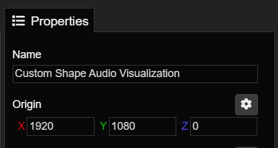
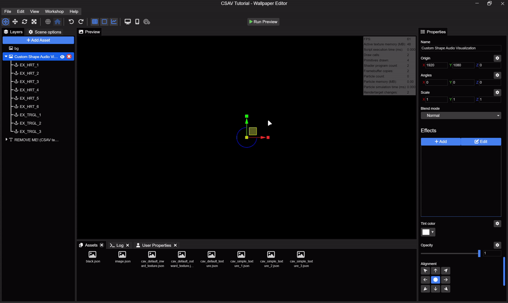
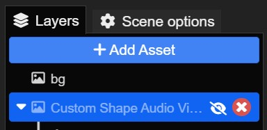
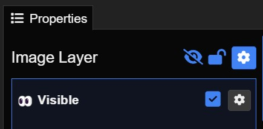

# 1.2 - Some basics

## 1. Moving Asset

You have two ways to move the asset:

1. Change the `X` and `Y` values of the origin in the Properties tab.

  
2. `Click, hold, and drag` to move its position.

   
## 2. Visible

In this asset, you `cannot hide` it in the default way like this:

  
Instead, you will change it in the `Visible` section within the `asset's Properties tab`.

