# 1.3 - Create a shape

## 1. Asset Structure
> ⚠️ Child objects used to define point coordinates for the CSAV must be placed within the CSAV to ensure the asset functions correctly.
```
Custom Shape Audio Visualization (parent)
├── Child_1
├── Child_2
├── ...
└── Child_n
```

<br>

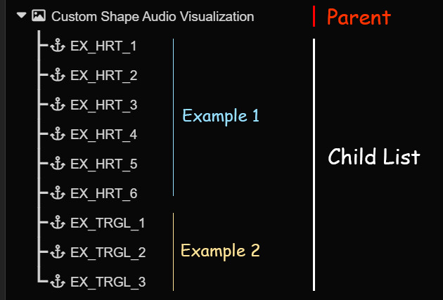
<br><br><br>
## 2. Curvature

> ⚠️ The curvature value is assigned to the child's Scale X parameter.

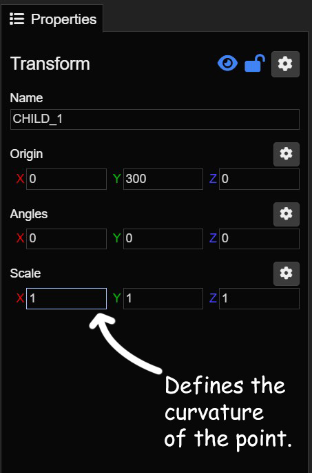

The scale x parameter of the child object defines the curvature.
+ `scale x = 0`: Sharp edges
+ `scale x > 0`: Curved / Rounded

The curvature of the arc is influenced by the curvature of its two endpoints.

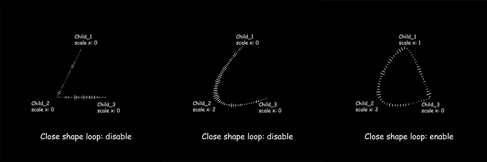

<br><br>

## 3. Creation steps from scratch (Triangle example)

### 3.1. Add asset to your project.

`Add Asset` --> `Transform` --> `Ok`<br><br>
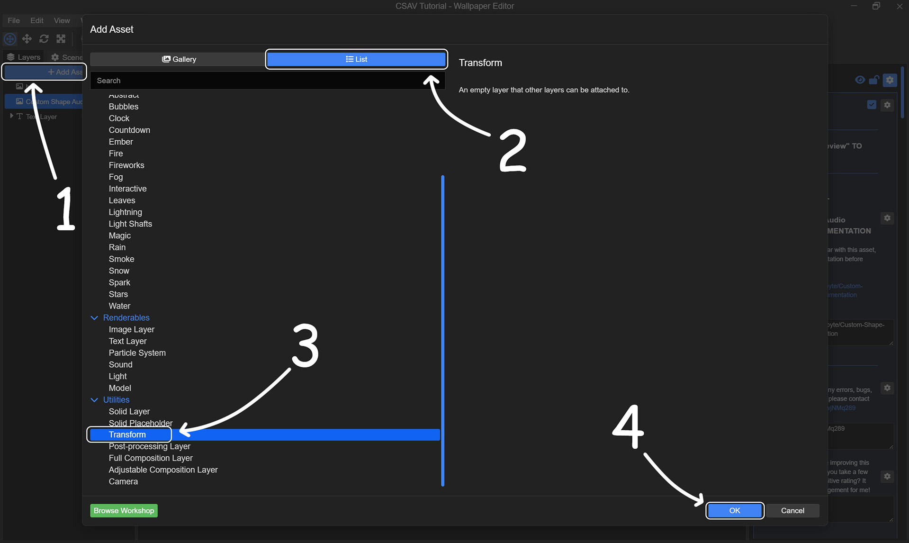

<br>

### 3.2. Move the newly created transform directly below the CSAV.

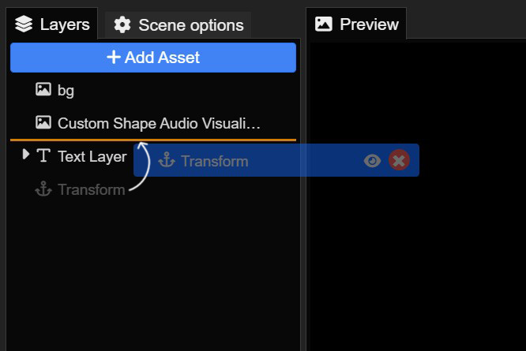

<br>

### 3.3. Set the Transform as a child of the CSAV.

`Right-click on the Transform` --> `Hierarchy` --> `Attach to Parent 'Custom Shape Audio Visualization'`

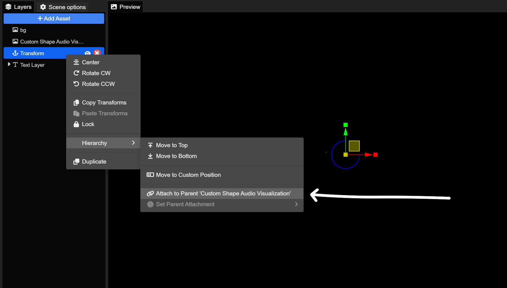

<br>

### 3.4. Refining the Child Objects

`Name`: Name the child objects
> ⚠️ The name MUST strictly follow the format: `<prefix name><number count>`

`Origin` (Optional): Reset the child's X and Y coordinates to 0 to snap it to the parent (CSAV) origin.
> This allows for easier manipulation when changing the global position.

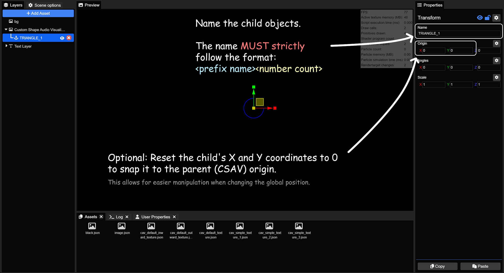

<br>

### 3.5. Duplicate the child objects as needed and number them accordingly.

The sequence must start at 1 and increment by 1.

Example:
+ Correct: `Child_1`, `Child_2`, `Child_3`, `Child_4`, ...
+ Incorrect: `Child_1`, `Child_2`, `Child_5`, `Child_6`,... => The CSAV will only recognize up to `Child_2`.

<br>

I will duplicate it into three children and rename them to follow the correct format.

`Right-click on the Transform` --> `Duplicate`

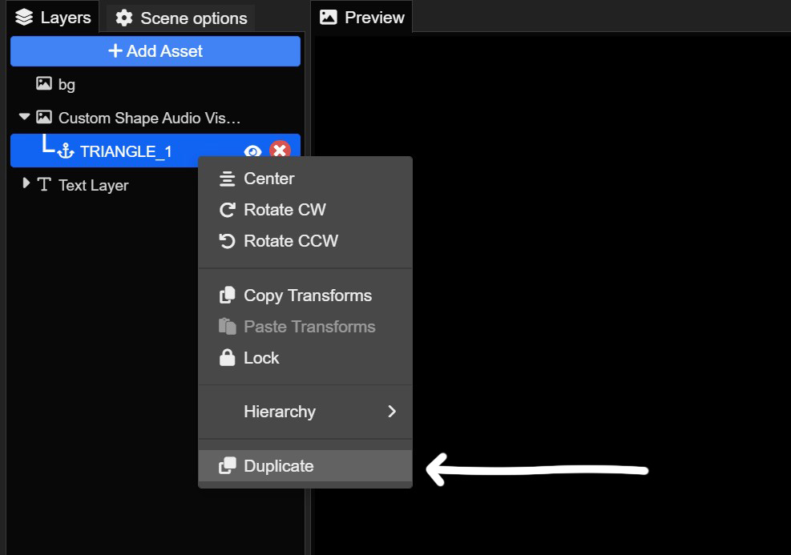

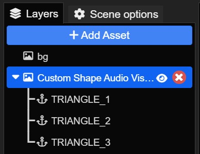

<br>

### 3.6. Position the child objects to form the desired shape.

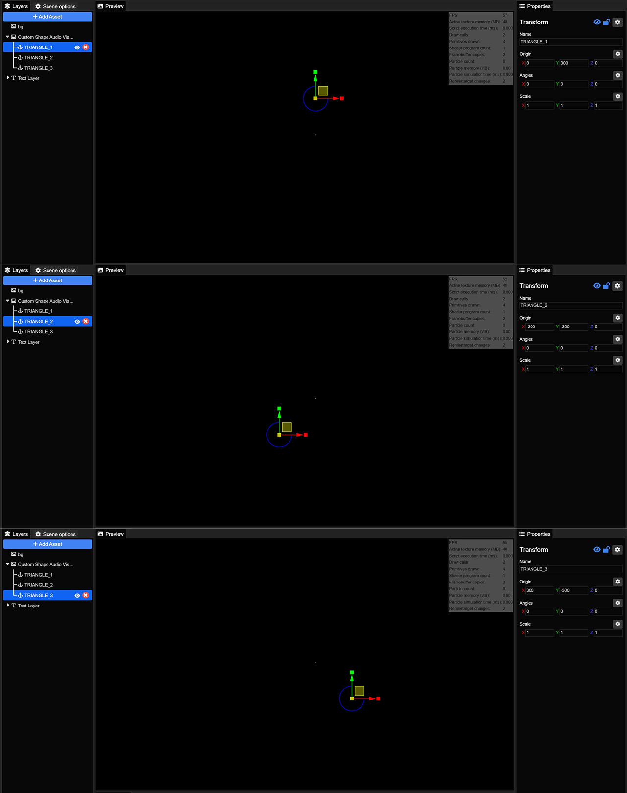

<br>

### 3.7. Configuring the CSAV.

+ Select the CSAV
+ Enter the child prefix name to `Child Layer Prefix`. In this case, my child prefix name is `TRIANGLE_`

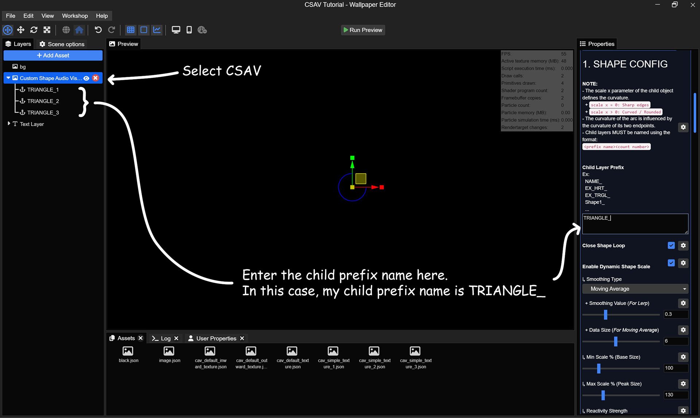

<br>

### 3.8. Click "Run Preview" to view the results.

All children: Curvature = 1 (Scale X = 1).
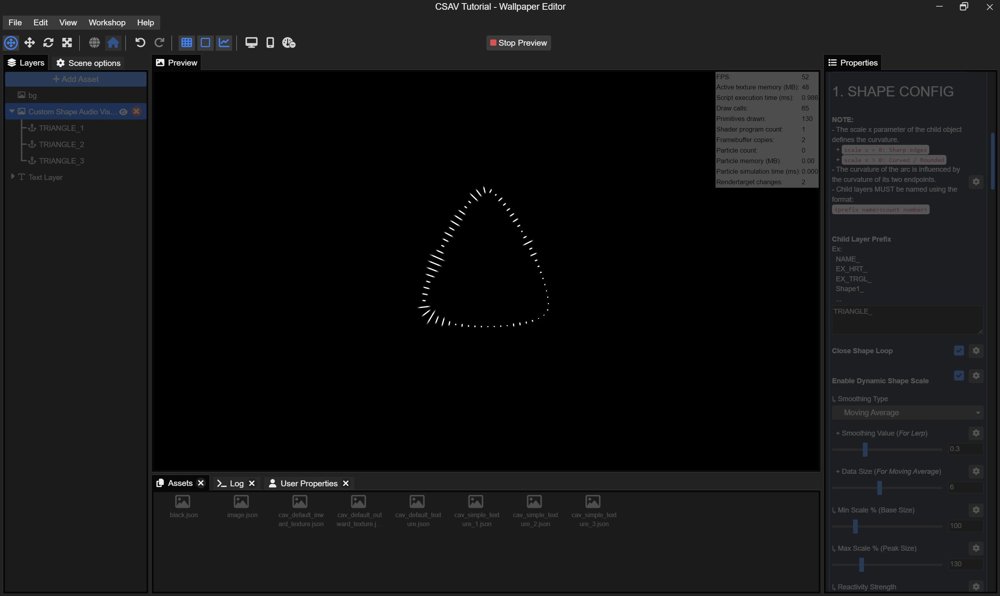

All children: Curvature = 0 (Scale X = 0).
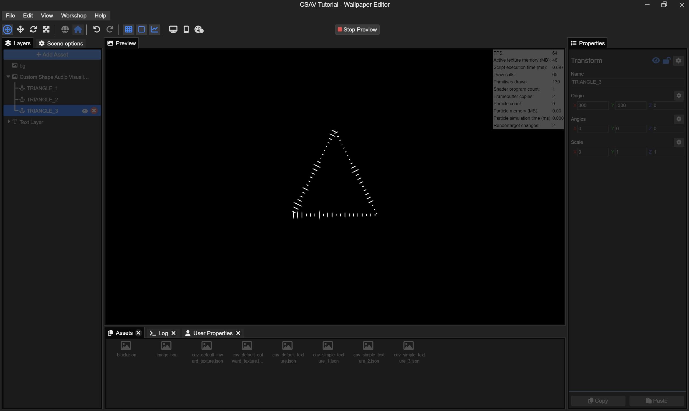
