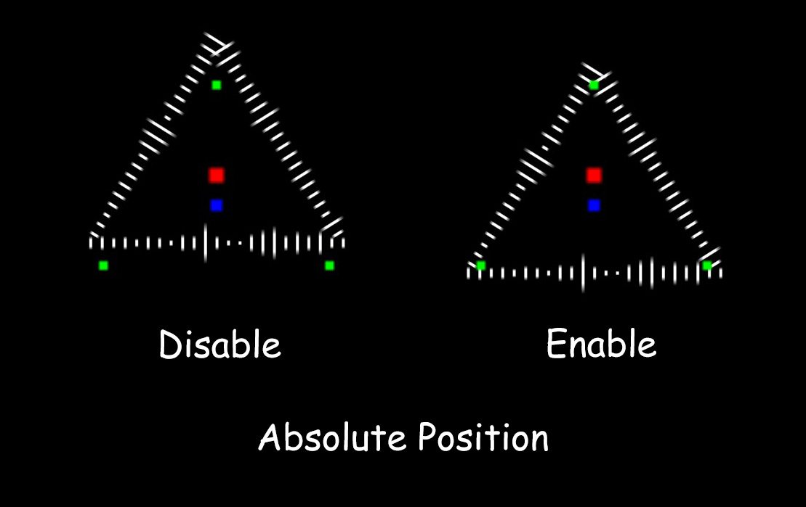

# 2.1 - Shape Config

`Child Layer Prefix`: The naming convention used to identify the child objects that form the shape.
+ Example: If you name your layers `Shape_1`, `Shape_2`, `Shape_3`,... enter `Shape_` here.

`Close Shape Loop`: Determines if the shape is a closed loop or an open line.
+ Enable: The last point connects back to the first point.
+ Disable: The shape remains open (a path with a start and end).

`Absolute Position`:
+ Enable: The algorithm uses the **shape centroid** (the actual average position of the child points) as the origin for rendering.
+ Disable: The algorithm captures your shape, calculates its rotation, and then offsets the entire shape to the **Script Layer's position** (*center*).

  

`Enable Dynamic Shape Scale`: If checked, the entire shape will pulse/scale in size according to the bass/beat of the music.

`Smoothing Type`: The algorithm used to smooth the shape's pulsing animation. 
+ `Moving Average`: Smoother, less jittery.
+ `Lerp`: Faster, more reactive.

`Smoothing Value (For Lerp)`: Controls how fast the shape resizes to the beat. Lower values are slower/smoother; higher values are snappier.

`Data Size (For Moving Average)`: The number of past audio frames to average. Higher values make the movement very smooth but less reactive to quick beats.

`Min Scale % (Base Size)`: The resting size of the shape when no audio is playing (100% = original size).

`Max Scale % (Peak Size)`: The maximum size the shape can reach during the loudest parts of the song.

`Reactivity Strength`: A multiplier for how sensitive the scaling is to the audio volume.
