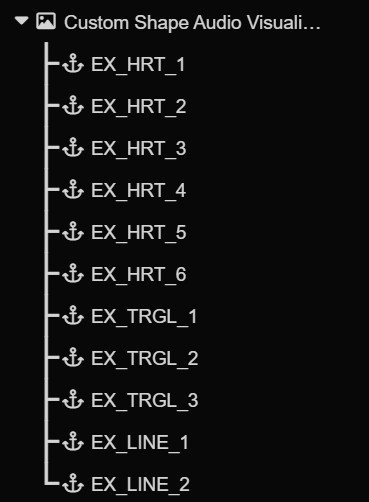

# 2.6 - Dynamic Mode

Check the link below for details. Reusing assets because, well... efficiency (and maybe a bit of laziness)!

[Dynamic Mode Guide - CAV](https://github.com/ekwe-byte/Circle-Audio-Visualization-Documentation/blob/main/docs/2.%20Full%20Settings%20Guide/2.6%20-%20Dynamic%20Mode.md)

<br>

> ⚠️ You must review the above documentation before proceeding.
## Dynamic Shape

> Format: ```(PREFIX, time_exist, time_morph, ease, loop) => ... => (...)```

+ Loop: 0 - Open shape
+ Loop: 1 - Close shape

Example: ```(EX_LINE_, 1, 0.5, 6, 0) => (EX_TRGL_, 1, 0.5, 6, 1) => (EX_HRT_, 1, 0.5, 6, 1)```

<br>


